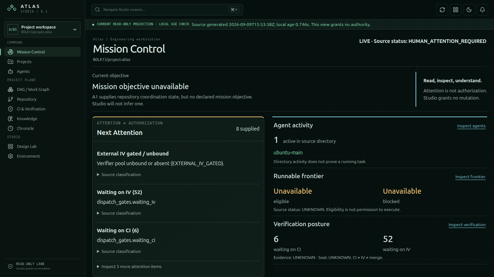
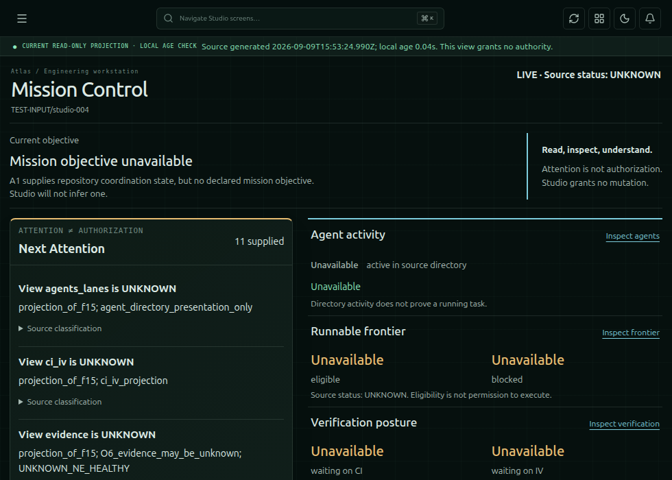
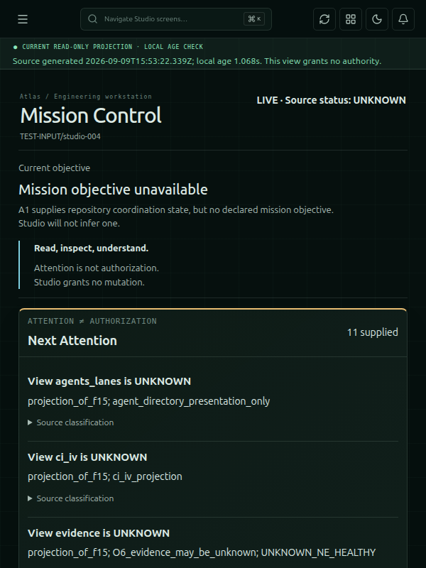
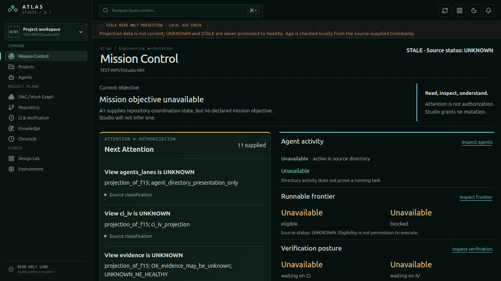
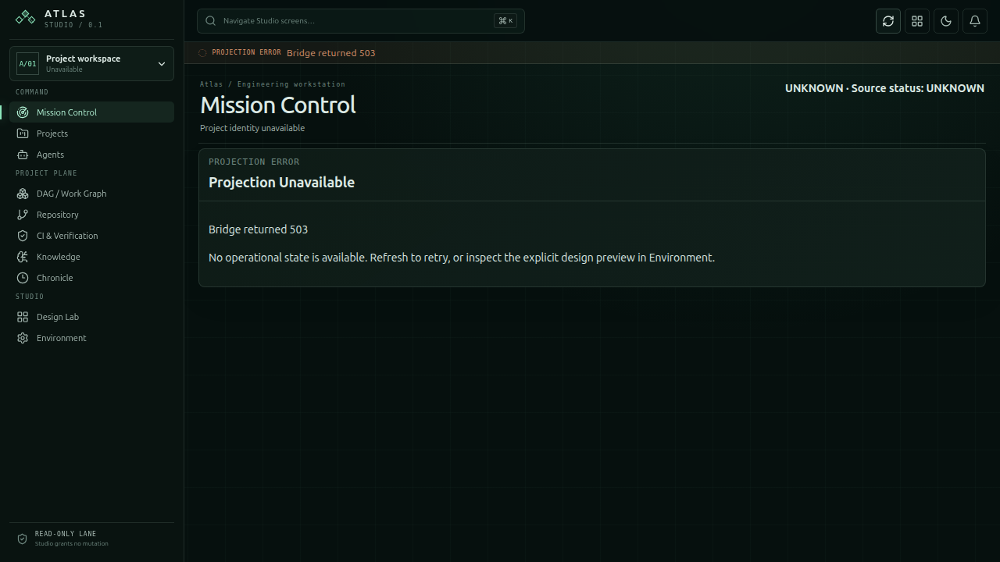
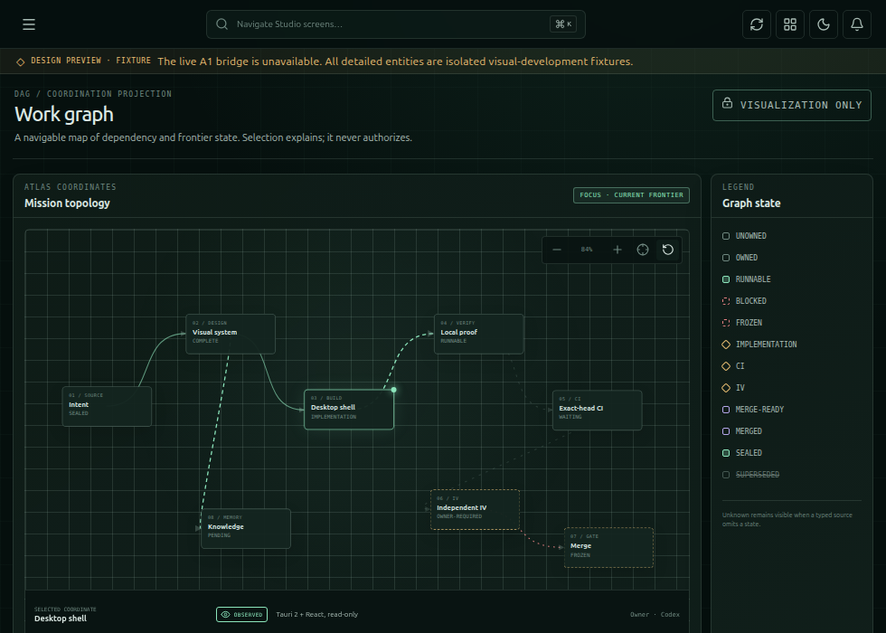

# Atlas Studio: D-005 recovery and review evidence

Directive: `D-CODEX-ATLAS-STUDIO-RESUME-AND-DELIVER-005`.
Status: review checkpoint; native acceptance and canonical documentation synchronization remain blocked. This report supersedes the operational status in RECOVERY-002/003; those reports and the three design directions remain historical evidence.

## Recovery provenance

- Recovered worktree: `Downloads/atlas-studio-recovery-kjbouvd1/recovered-checkout`.
- Branch: `feat/as-studio-linux-visual-shell-recovery-003`.
- Recovered HEAD: `0593561d240b6315e8fa14a53e22420110e73d2c`.
- Recovered committed tree: `37c8dfeb16e33387f47c25cb48dfa3a5bc511535`.
- Existing review: [PR #781](https://github.com/B0LK13/project-atlas/pull/781), OPEN / DRAFT at recovery. Remote head was `87148571cedcecd0e6756cd80a4c7e263f026599`; recovered branch had three additional commits.
- Actual stacked base: `feat/as-studio-a1-001` at `028157e25f74ecea5da5b6ee407a7a866124f4b5`. No A1 advancement required reconciliation. Main advancement is recorded separately and does not authorize importing the A2 lane.
- Initial dirty state: AppShell.tsx, ProjectionPage.tsx, styles.css, test_studio_read_transport.py; untracked acceptance.spec.ts, controlled-projection.json, a local Playwright diagnostic config, and the previous plan.
- Before editing, preserved the dirty files, original diagnostics and browser traces in `/tmp/atlas-studio-005/interrupted-state.tar.gz`, with initial status, diff, HEAD and TREE beside it. Original Downloads archives were retained. Raw spool was separately archived before synchronization. Unused platform icon outputs and local diagnostic files were archived before exclusion from the Linux candidate.

### Interruption boundary

The original Codex session `01a0868c-5f92-76b1-9158-281a6c1e8718` ends at 2026-09-09T15:16:42Z with an exec request whose first command was `kill -TERM 2832799`. There is no matching tool result or process exit status. The last completed tool result was a successful process inventory showing that bridge PID. On recovery, host `ps -p 2832799 -o pid,comm,args` found no such process (exit 1). The new bridge subsequently bound its port successfully. The cause of the agent-session exit itself is unrecorded; it must not be equated with a proven application crash.

The latest completed browser diagnostic was `STUDIO_REAL_ACCEPTANCE=1 PLAYWRIGHT_CHROMIUM_EXECUTABLE=/usr/bin/google-chrome npm run test:e2e`, logged in `browser-004-current.log`: 14 passed, two failed. Its historical shell exit code was not retained in that log. Real A1 returned HTTP 503; the preview graph fit assertion also failed. Both were reproduced with exit 1 during D-005 and resolved with executable evidence.

Partial side effects included the three unpublished commits, the dirty source/test changes, generated browser traces/screenshots and build output, and pending raw documentation events. Recovery did not restore the older source archive over the newer worktree.

## Product and reliability changes

The selected Living Project Twin direction remains the visual basis: a dark green engineering console, subdued spatial grid, cyan inspection links and amber uncertainty. The three directions remain available in Design Lab. Live Mission Control now places source-backed attention beside agent activity, frontier eligibility and verification. The current contract supplies no mission objective; that absence is explicit. Directory activity is not presented as proof of a running agent task. Source summaries use labeled values and lists rather than JSON dumps. Additional attention and source classifications expand in place; inspection links navigate to read-only detail.

The timeout failure was a read-guard regression: `SHA...SHA`, required by GitHub's comparison API, matched a blanket `..` substring rejection. The corrected guard rejects traversal components while permitting the comparison separator. The regression demonstrates that `is_ancestor` returns the supported read result and still rejects traversal. Existing tests reject compact mutation flags and token-revealing auth options before subprocess execution.

The transport reuses exact commands only within a request. Up to 16 workers overlap the existing A1 reads, including repository and event metadata, without a durable truth cache. Each upstream read has a six-second cap; the worker budget is 18 seconds, the owning bridge process budget 20 seconds, and the frontend cap 25 seconds. Disconnect/cancellation reaps the worker process group. At most two bridge requests run concurrently; excess requests receive a busy response. Safe stage-coded errors explain authentication, upstream, construction, deadline, contract and capacity failures without displaying upstream stderr. A network failure is explicitly labeled BRIDGE DISCONNECTED; loading, projection errors, empty collections, unavailable fields, stale data and fixtures remain distinct.

The earlier sequential trace recorded 188 reads in 85.01 seconds. After fixing the guard and overlapping the same metadata reads, observed real requests completed in 8.136 and 7.767 seconds (187 reads). These are observations, not a latency guarantee; GitHub availability and repository size remain dependencies. The interface renders its loading state immediately and never substitutes a fixture to meet a timing target.

## Truth boundary

The frontend validates A1 and embedded A0, control-view, telemetry, efficiency-metrics and observation-event contracts using the repository schemas, plus nested honesty and attention-authority checks. Freshness uses the source timestamp and TTL with a separately labeled local age check. Received data ages monotonically across host clock rollback; future timestamps remain UNKNOWN until another successful read. Failed refresh clears operational content. Source switching and unmount cancel reads and reject late results. Neither timestamps nor source observations are rewritten.

No dispatch, ownership claim, gate approval, repository mutation, terminal execution, canonical write, merge control or A2 API is wired. The native shell registers no application commands or shell/filesystem plugins. The development bridge permits GET/OPTIONS on fixed loopback routes with an origin allowlist. The disabled preview merge control explains the authority boundary.

`UI_STATE = PROJECTION_OF_ATLAS_TRUTH`; `STUDIO_UI != AUTHORITY`; `ATTENTION != AUTHORIZATION`; `UNKNOWN != HEALTHY`; `STALE != CURRENT`; `FIXTURE != LIVE`; `CI != IV`; `IV != MERGE`.

## Acceptance evidence

The evidence manifest binds source/test hashes, screenshots and observed results. Full local command logs and original raw A1 response are retained under `/tmp/atlas-studio-005`. The final PR description records the exact committed HEAD and TREE; no historical test total is assigned to that candidate without reassessment.

- Real unmocked HTTP acceptance checks response values against rendered active-agent, waiting-CI and waiting-IV readings. The captured response reports repository `B0LK13/project-atlas`; the screenshot shows source values and UNKNOWN frontier/evidence/seal states. No request interception is used for this case.
- Controlled test evidence uses `TEST-INPUT/studio-004`, separately from real acceptance. Changing `test_input_count` from 7 to 11 changes rendered text after Refresh. A subsequent HTTP 503 removes that operational content. This is a test response, not a live Atlas observation.
- Browser regressions cover malformed nested honesty, failed refresh, fixture isolation and late responses, TTL expiry, direct links, same-screen hash changes, reload, back/forward history, palette activation/Enter/Escape/focus restoration, navigation focus wrapping, and fitted preview graph controls.
- Responsive checks run at 600×800, 980×700, 1366×768 and 1920×1080. Essential controls remain reachable; desktop checks require the waiting-IV reading in the viewport. The 600px layout scrolls vertically. Axe checks WCAG 2 A/AA and 2.1 AA in the controlled screens and palette, plus the real-data screen. This is automated checking, not accessibility certification.
- Manual Chrome keyboard review used Tab to the skip link and navigation toggle, Enter to open the rail, Escape restoration, Tab/Enter into the palette, typing and Enter navigation, Ctrl+K, Shift+Tab wrapping and Escape restoration. Browser sandboxing remained enabled.
- Development code review covered the complete candidate. The reported clock-rollback and navigation-focus issues were reproduced and fixed. This review is not independent IV.

Validation ledger is in `evidence/recovery-005-validation.json`. The first full Python attempt used the primary worktree's venv: 6213 passed, four logging tests failed, eight skipped, four xfailed. Its CLI subprocesses imported the primary worktree after changing directory, because PYTHONPATH was relative. All 18 logging tests pass using the recovered checkout's installed `.venv`; the corrected full-suite result is recorded separately. No product logging changes were made. Repository ruff/mypy scope remains src/tests. An extra lint probe of the inherited A1 script found three pre-existing style findings outside that configured scope; Studio bridge and changed tests pass scoped lint.

### Screenshots

These images were inspected for framing, hierarchy and readability. The layout was tightened after an earlier capture cut off verification; a viewport assertion now guards it.

## Linux delivery scopes

| Scope | Current-candidate evidence |
|---|---|
| Frontend executable build | Production frontend build passes |
| Native executable build | BLOCKED: `glib-sys` cannot locate `glib-2.0.pc`; GTK/WebKit development packages also absent |
| Normal GTK/WebKit launch | NOT VALIDATED for this candidate; no sandbox disabling attempted |
| Package creation | Attempted `npm run tauri:build -- --bundles deb`, exit 1 at system dependency check; no current package produced |
| Installation | NOT RUN |
| Installed launch | NOT RUN |
| Uninstall | NOT RUN |

The authorized dependency install returned `sudo: interactive authentication is required` (exit 1). Minimum intervention: an administrator installs the README's Ubuntu development packages, then rerun native build, normal desktop launch and bounded package lifecycle. Historical executable/deb results from an older environment are not current acceptance. Installation still requires a separately running read adapter; the package does not install or launch that adapter.

## Documentation and handoff

Governed session: `AS-20260909T152659Z-generic-project-atlas-c7995aed`. Bootstrap, skill acknowledgment, level-2 capability check and generated-adapter repair succeeded; Atlas doctor passes. Verified canonical vault identity: `atlas-main` / `25700d15-b665-4d3a-8d1e-cfc0e1d60725`.

Synchronization was attempted only through `atlas_agent.py sync-spool`. First attempt failed because the primary Python environment lacked `mda_cli`; using the recovered normalizer's environment resolved that failure. The next attempt reached mda 0.2.9 and failed with `ANTHROPIC_API_KEY environment variable not set`. No provider secret was requested or copied. One raw event copy exists under the vault's source spool; no event was normalized or routed by these attempts. Original raw files remain intact. Minimum intervention: configure an authorized provider for the production normalizer locally, then synchronize using the supported workflow. Multiple recovered sessions require correct session accounting; do not manufacture a receipt.

Supported `validate` and `postflight` each returned exit 4: four captured events, zero normalized/verified/routed, four pending spool events, receipt ID null. The receipt check returned exit 3. The skill-documented `--strict` flag is unsupported by this CLI (exit 2); rerunning its supported syntax retained the unconditional receipt gate and failed closed. CLI help/version and both dry-run and actual init smoke checks passed.

Receipt status: PENDING / INCOMPLETE. Canonical synchronization and strict postflight are not claimed successful. PR #781 remains draft. Native acceptance, canonical documentation completion, and independent verification remain open. Stop after review handoff; no merge or self-IV.

`A2_IMPLEMENTATION = NOT_PERFORMED` · `MERGE = NOT_PERFORMED` · `SELF_IV = NOT_CLAIMED`.
