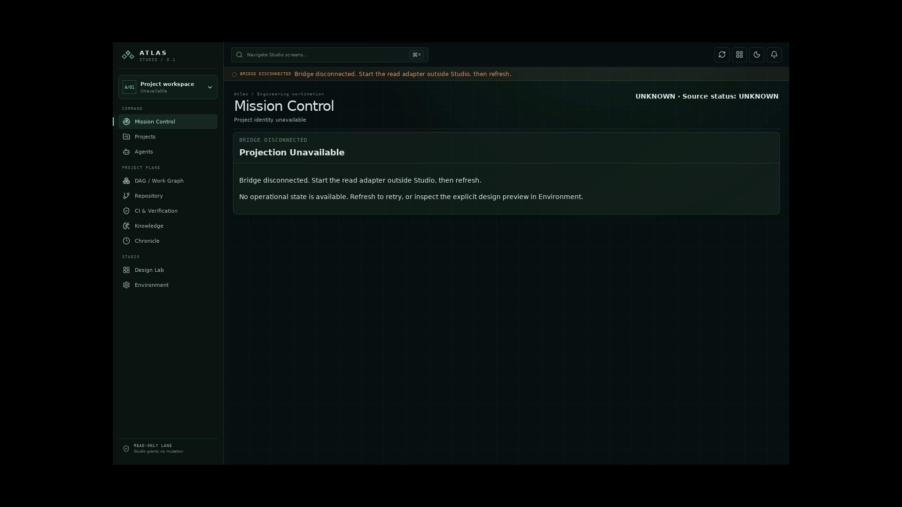
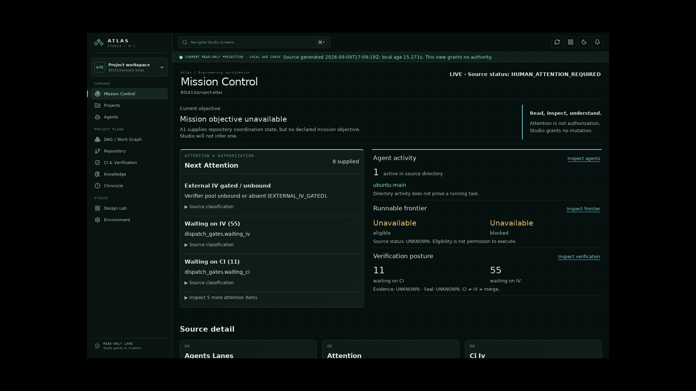

# D-006: native delivery gate evidence

The administrator installed supported Ubuntu prerequisites. This exposed a real native-only startup defect: the executable created a window but its document remained empty. Runtime Ajv compilation used `new Function`, rejected by the unchanged production CSP. A browser regression applying that exact CSP reproduced `EvalError`; the fix compiles the same six canonical schemas into static validators during Vite builds. Runtime schema/honesty checks and native security policy remain intact. The Unicode helper is imported statically; schema files are watched during development. Generated validator output stays in build artifacts, not repository source.

## Current validation

- Frontend: 36 tests, TypeScript and production build pass.
- Browser: 17 pass (28.6s), including the new production-CSP startup test and explicitly enabled authenticated A1 acceptance. No skipped tests. The earlier simultaneous native/browser build caused a transient preview asset response failure; the serial final run passes. No assertion was weakened.
- Focused desktop/read-transport Python: 19 pass. Python production code is unchanged; expensive full local Python suites were not repeated. Fresh remote CI is required for the successor HEAD and is recorded in PR #781, not inferred from predecessor success.
- Development review found no material defect; its schema-watching suggestion was applied. This is not independent IV.
- `npm audit` reports two moderate development-only notices in the existing Vitest/mocker dependency chain (GHSA-82fw-gwwq-j7x9). They predate the added Node typings; no unrelated major Vitest upgrade was applied. They are not native runtime dependencies.

## Native Linux evidence

Environment: Ubuntu 26.04.1 LTS, ordinary Wayland session, GLib 2.88.0, GTK 3.24.52, WebKit 2.52.6, Rust/Cargo 1.98.1. `npm run tauri:build -- --bundles deb` passed after the CSP fix. The release executable was launched directly in the ordinary desktop session. No WebKit/Chromium sandbox was disabled, no mutation plugins were introduced, and no app commands were registered.

AT-SPI inspection of the actual GTK/WebKit document confirms the product renders, navigation activates, and real A1 values reach Mission Control: one active agent (`ubuntu-main`), nine waiting CI and 54 waiting IV. Frontier remains unavailable/UNKNOWN, and evidence/seal remain UNKNOWN. These are time-bound observations, not immutable project counts.

The test stopped only its own read bridge, activated the native refresh control, and observed `BRIDGE DISCONNECTED` with the old active-agent data absent. Restarting the bridge and refreshing returned `CURRENT READ-ONLY PROJECTION`. Actual native accessibility captures are preserved in `evidence/recovery-006-native-mission-a11y.json`, `evidence/recovery-006-native-error-a11y.json` and `evidence/recovery-006-native-restored-a11y.json`.

Native screenshot status: the direct GNOME screenshot method denied access; the interactive portal returned no file. The supported screenshot-sharing portal succeeded, but the initial capture showed other foreground windows and was excluded from repository evidence. An additional installed-package WebKit capture under Xvfb succeeded and was inspected (below). It is an actual native rendering of the disconnected state; it is not an ordinary Wayland foreground screenshot. Existing browser screenshots are not claimed as native screenshots.

## Package scopes

| Scope | Result |
|---|---|
| Native executable build | PASS |
| Ordinary Wayland launch and actual projection/error/recovery | PASS via native accessibility evidence |
| Debian package creation | PASS |
| Installation | PASS in disposable rootless Podman Ubuntu 26.04 |
| Installed launch | Non-root process survived 12 seconds; Xvfb window inventory showed Atlas Studio 1440×900; no sandbox-disabling flags |
| Installed rendering | Additional AT-SPI assertions verified BRIDGE DISCONNECTED and Projection Unavailable; actual WebKit screenshot captured and inspected |
| Uninstall | PASS; package removed and executable absent |

The container used default isolation. Xvfb reported expected DRI3 graphics warnings; a portal mount reported unavailable FUSE. Neither prevented the process/window check or uninstall. The host was not used as an installation target. The exact Debian artifact hash is in the validation ledger; the package and complete diagnostics remain under `/tmp/atlas-studio-006`.

The additional installed rendering check and its subsequent uninstall both passed. A final installed-package run also loaded actual authenticated A1 through the existing host read bridge, without replay or interception. The rootless container used host networking to reach the localhost endpoint; WebKit sandboxing remained unchanged. AT-SPI assertions verified CURRENT READ-ONLY PROJECTION, Mission Control and ubuntu-main. The inspected native screenshot shows one active agent, 11 waiting CI and 55 waiting IV at source time 2026-09-09T17:09:19Z. Uninstall passed again. Ordinary host-native live/error/recovery evidence remains recorded separately above.

## Documentation and authority

The four D-005 raw events remain unchanged with a separate archive/hash ledger. D-006 work is captured through the supported Atlas session. Normalizer provider credentials remain unavailable; no normalization, routing, receipt or successful postflight is invented. The mixed recovered spool requires correct per-session accounting when supported synchronization resumes.

The PR remains draft pending canonical documentation acceptance and any remaining native evidence gaps. Final HEAD/TREE and fresh CI results are recorded in the PR handoff. `A2_IMPLEMENTATION = NOT_PERFORMED`; `MERGE = NOT_PERFORMED`; `SELF_IV = NOT_CLAIMED`.
